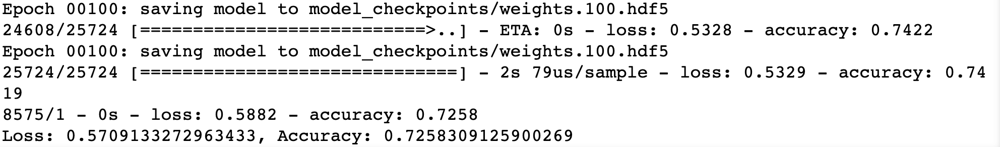
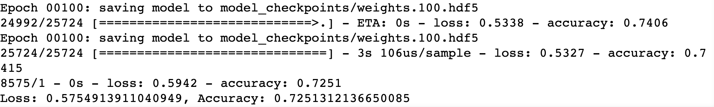
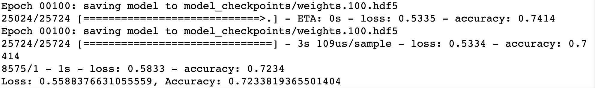

# Modeling with Neural Networks

## Overview

The purpose of this analysis is to practice modeling with Neural Networks.

## Results

* Data Preprocessing

    1. Target variable: IS_SUCCESSFUL

    2. Feature variables: STATUS, ASK_AMT, APPLICATION_TYPE, AFFILIATION, CLASSIFICATION, USE_CASE, ORGANIZATION, INCOME_AMT, SPECIAL_CONSIDERATIONS

    3. Removed variables: EIN and NAME

* Compiling, Training, and Evaluating the Model

    1. Model Parameters

        * Neurons: 80, 30

        * Layers: 2

        * Activation Function: relu in first and second layer, sigmoid in output layer

        * Analysis: I initially used a conservative two layer neural network. The first layer had 80 neurons and the second had 30. Both hidden layers used a 'relu' activation function because that is the most common activation function in use. The output layer used a sigmoid function by design: I want to preduct the probability of a certain output (if the donor parameters lead to a successful result).

    2. Target Model Performance

        * Goal: 75%

        * Actual: 73%

        * Analysis: I trained the model using 50, then 100 epochs. Both times I received a 73% accuracy score.

    3. Additional Performance Steps:

        * Step 1: I added an additional hidden layer with 25 neurons using a relu activation function. I kept the first two layers the same. After training on 100 epochs, I received the same 73% score.

        

        * Step 2: In addition to step 1, I increased the number of neurons in each layer as such:

            * Layer 1: 90
            * Layer 2: 40
            * Layer 3: 35

            However, this did not lead to a better accuracy score. The model gave a similar accuracy score from the previous step.

        

        
        * Step 3: Using step 2 as a foundation, I changed the activation functions and neurons for all hidden layers (output layer remains the same):

            * Layer 1: 75 neurons and tanh activation
            * Layer 2: 45 neurons and tanh activation
            * Layer 3: 35 neurons and tanh activation

            Unfortunately, this still did not result in any noticeable improvement. After these three steps, I was unable to reach the target 75% model performance. 

        

## Summary

In short, even with additional modifications to the model, I was unable to reach the 75% target. The next step in this analysis would be to utilize a different ML algorithm. The first algorithm I would use is a Random Forest. It can combine many predictions into one model. It could easily be used with the current dataset. And is computationally cheaper than than a Neural Network. 
